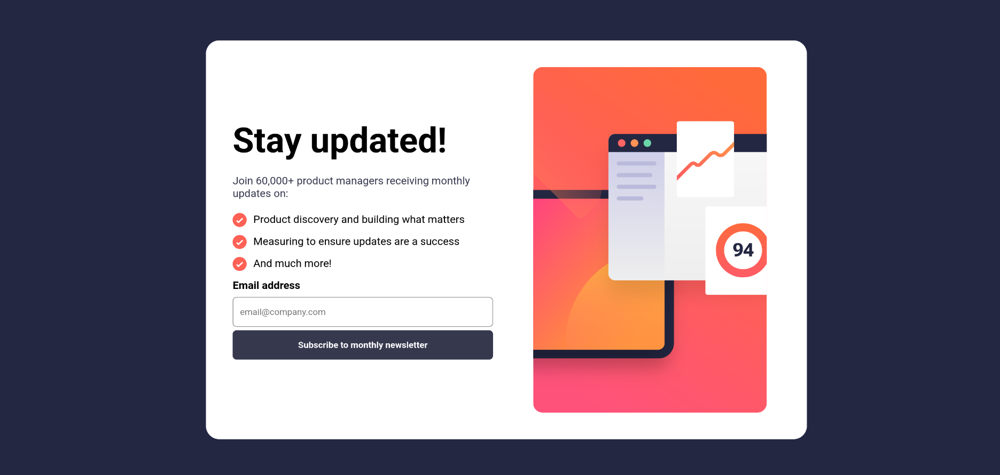

# CodeTribe Final Project - Newsletter Sign-up Form with Success Message Solution

This is my solution to the **Newsletter Sign-up Form with Success Message** challenge on CodeTribe bootcamp. The project focuses on building a responsive newsletter subscription interface with form validation, interactive states, and a success confirmation message.

## Overview

### The Challenge

Users should be able to:

* Enter their email address and submit the form.
* View a success message containing their submitted email address.
* Receive validation feedback when:

  * The email field is empty.
  * The email address format is invalid.
* Experience an optimized layout across different screen sizes.
* See hover and focus states for all interactive elements.

### Screenshot



### Links

* Live Site URL: https://khulisojohn.github.io/newsletter-sign-up/

---

## My Process

### Built With

* Semantic HTML5
* CSS3
* Flexbox
* CSS Grid
* Mobile-First Workflow
* JavaScript

### What I Learned

Through this project, I strengthened my understanding of:

* Form validation using JavaScript.
* Handling user input and displaying dynamic content.
* Creating responsive layouts with Flexbox and Grid.
* Improving user experience through hover and focus states.
* Managing conditional rendering between the subscription form and success message.

Example of email validation:

```javascript
const emailPattern = /^[^\s@]+@[^\s@]+\.[^\s@]+$/;

if (!emailPattern.test(emailInput.value)) {
  showError("Valid email required");
}
```

### Continued Development

Going forward, I would like to focus on:

* More advanced form validation techniques.
* Accessibility best practices.
* CSS animations and transitions.
* Building reusable UI components.
* Strengthening my responsive design skills.

### Useful Resources

* CodeTribe Bootcamp – Challenge specifications and design assets.
* MDN Web Docs – HTML, CSS, and JavaScript documentation.
* CSS Tricks – Helpful guides on Flexbox and Grid layouts.

---

## Author

### Khulyso John

* GitHub: https://github.com/KhulisoJohn
* Portfolio: https://khulisojohn.github.io/my_portfolio
* LinkedIn: https://www.linkedin.com/in/khulyso

---

## Acknowledgments

Special thanks to the CodeTribe  bootcamp for providing realistic frontend challenges that help developers improve their practical web development skills. This project provided valuable experience in responsive design, form handling, and user interface development.
